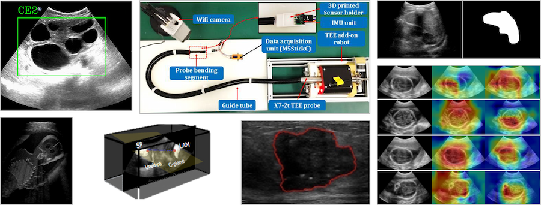

# Past Workshops & Related Links

Please see below for information of previous MICCAI ASMUS workshops:

- [ASMUS 2023](asmus23.md)
- [ASMUS 2022](asmus22.md)
- [ASMUS 2021](asmus21.md)
- [ASMUS 2020](asmus20.md)

Other related MICCAI Workshops, Tutorials, and Challenges:

- [Thyroid 2020](https://zenodo.org/record/3715942): Thyroid Nodule Segmentation and Classification in Ultrasound Images
- [POCUS 2018](https://blog.kitware.com/events/pocus-miccai2018/)
- [SlicerIGT 2018](https://www.slicerigt.org/wp/miccai-2018-tutorial/): Hands-on Tutorial on Rapid Prototyping of Ultrasound-Guided Intervention Systems
- [POCUS 2017](https://blog.kitware.com/events/pocus-miccai2017/)

