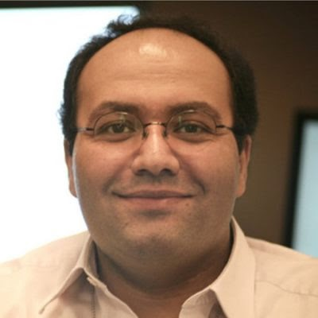
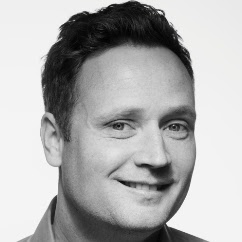
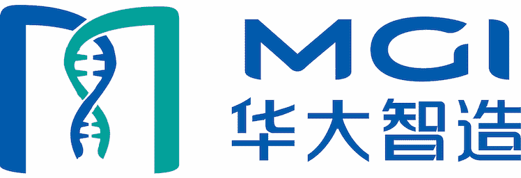
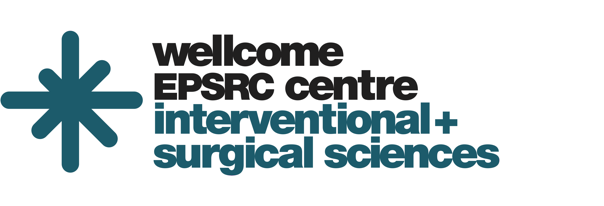
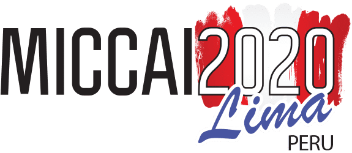

# ASMUS Workshop '20

**The 1st International Workshop of Advances in Simplifying Medical UltraSound (ASMUS) - a workshop held in conjunction with [MICCAI 2020](https://www.miccai2020.org/), the 23rd International Conference on Medical Image Computing and Computer Assisted Intervention.**

## Program

**The workshop took place on 4th October 2020 and included the [Thyroid Nodule Segmentation and Classification in Ultrasound Images Challenge](https://www.google.com/url?q=https%3A%2F%2Ftn-scui2020.grand-challenge.org%2FHome%2F&sa=D&sntz=1&usg=AFQjCNEPKv8JHsTOMRNq-au54ZiJ79Y3vg), live practical technology demonstrations, Q&A sessions and two keynote talks.**

## Proceedings

The ASMUS workshop proceedings are published as part of Springer's Lecture Notes in Computer Science series. The ASMUS 2020 proceedings can be found [here](https://www.springer.com/978-3-030-60333-5).

## Prizes and Awards

Prizes were awarded in 3 categories: best paper, best demonstration and best presentation. All awards were sponsored by MGI Tech Co Ltd. and the winners are listed below:

| Award                          | Winner                                                        |
| ------------------------------ | ------------------------------------------------------------- |
| Best Paper                     | Zachary Baum et al. (University College London)               |
| Best Paper (Runner-Up)         | Kevin Gilboy et al. (Johns Hopkins University)                |
| Best Presentation              | Mohammad Alsharid et al. (University of Oxford)               |
| Best Presentation (Runner-Up)  | Helena Williams et al. (KU Leuven)                            |
| Best Demonstration             | Thomas van den Heuvel and Chris de Korte (Radboud University) |
| Best Demonstration (Runner-Up) | Bradley Moore (Kitware)                                       |

## Keynote Speakers

### Emad Boctor

#### Assistant Professor, Johns Hopkins University

  

Emad Boctor is Assistant Professor at the Johns Hopkins Department of Radiology and Radiological Science. His research interests are focused on image-guided interventions using advanced ultrasound and optical imaging techniques. These include photoacoustics, functional NIR methods, ultrasound tomography, thermometry, elastography imaging, and machine learning-based ultrasound reconstruction methods.

### Lasse Løvstakken

#### Professor, Norwegian University of Science and Technology

  

Lasse Løvstakken is a Professor at the Norwegian University of Science and Technology Department of Circulation and Medical Imaging. His research interests include high-speed and real-time quantitative medical ultrasound, advanced image formation, visualisation of blood and tissue dynamics, and machine learning.

## Organizers

### Chairs
* Yipeng Hu (Co-chair, University College London, UK) 
* Alison Noble (Co-chair, University of Oxford, UK) 
* Stephen Aylward (Co-chair, Kitware, USA) 

### Organising Committee
* Chris de Korte (Radboud University Nijmegen, Netherlands) 
* Dong Ni (Shenzhen University, China) 
* Gabor Fichtinger (Queen’s University, Canada) 
* Jan d’Hooge (KU Leuven, Belgium) 
* Kawal Rhode (King’s College London, UK) 
* Nassir Navab (Technical University of Munich, Germany) 
* Purang Abolmaesumi (University of British Columbia, Canada) 
* Russ Taylor (Johns Hopkins University, USA) 
* Su-Lin Lee (University College London, UK) 

### Program Chair
* Alex Grimwood (University College London, UK)

### Demonstrations Chair
* Zachary Baum (University College London, UK)

## Sponsorship

  

---

  

