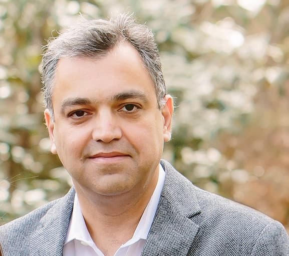
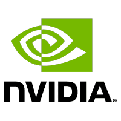

# ASMUS Workshop '21

 

**The 2nd International Workshop of Advances in Simplifying Medical UltraSound (ASMUS) - a workshop held in conjunction with [MICCAI 2021](https://www.miccai2021.org/), the 24th International Conference on Medical Image Computing and Computer Assisted Intervention.**

**ASMUS is the offical workshop of the [MICCAI Special Interest Group on Medical Ultrasound](home).**

>**The ASMUS Workshop starts on September 27th! [View the full program](/files/program.pdf ':ignore') and [join us on Pathable](https://miccai2021.pathable.eu/meetings/zKYwMi7ttwQw5HcxG) for the workshop**.

## Call for Papers

Papers will consist of maximum 8 pages (text, figures and tables) + up to 2 pages for references only. They are to be submitted electronically in [Springer LNCS (Lecture Notes in Computer Science) style](https://www.springer.com/gp/computer-science/lncs/conference-proceedings-guidelines) and are subject to double blind review. Please submit your work via the [Springer OCS portal](https://ocs.springer.com/ocs/home/ASMUS2021).

The papers will be evaluated by external reviewers and our organizing committee for inclusion in the workshop as a presentation (oral or poster). Accepted full-length manuscripts will be published with Springer LNCS and the best papers will be selected for industry-sponsored awards. Original research contributions are invited. Proof-of-concept research from novel research directions is also encouraged.

Authors of selected best papers will be invited to submit extended versions to a special issue of The Journal of Machine Learning for Biomedical Imaging (MELBA).

  

One of the popular features of ASMUS 2020, live demonstrations, will be repeated in ASMUS 2021. Capitalising on the unique real-time and portability aspects of ultrasound-based applications, we plan for live demonstrations covering AI, interventional and robotics areas. All accepted papers will be offered the option to present a live demonstration.

| Workshop Timeline              |                            |
| ------------------------------ | -------------------------- |
| ~~June 25 2021~~ July 2 2021   | Paper Submission Deadline  |
| ~~July 16 2021~~ July 26 2021  | Notification of Acceptance |
| ~~July 30 2021~~ August 9 2021 | Camera Ready Submission    |
| September 27 2021              | ASMUS Workshop             |

## Program

**The full day ASMUS workshop will take place on 27th September 2021, and include live practical technology demonstrations, paper presentations, Q&A sessions, and keynote talks.**

>This year's ASMUS will feature [3 keynotes](#keynote-speakers), 6 live demonstrations, and over 20 presentations on cutting edge research from international academics and industry leaders. The full program is available [here](/files/program.pdf ':ignore'). 

ASMUS 2021 aims to provide an intellectually stimulating forum to bring together the international MICCAI research community working towards the next generation of medical ultrasound imaging methods, systems and practices. 

In this exciting era for medical ultrasound, recent developments in deep learning (artificial intelligence) and medical robotics have started to show clinically measurable improvement in assisting ultrasound examinations, ultrasound-guided interventions and surgery. This year, ASMUS is soliciting submissions, including work from the following areas:

### Ultrasound Assisted by Artificial Intelligence and Medical Robotics:
- Ultrasound imaging with robotic (automated) assistance
- Machine learning methods in ultrasound analysis and guidance
- Automated interpretation and measurement for ultrasound
- Ultrasound quality and skills assessment

### Multimodality Ultrasound Imaging:
- Ultrasound with other non-imaging sensory information, e.g. positional and eye tracking
- Ultrasound with another pre-/intra-procedural imaging, e.g. camera videos, CT, MR, fluorescence
- Different modes of ultrasound imaging, e.g. photoacoustic, Doppler, functional ultrasound, tissue quantification

### Applications:
- Global healthcare
- Training sonographers and other users
- Assisting non-expert healthcare professionals
- Point-of-care ultrasound systems and scenarios
- Assisting surgery and interventions
- Streamlining clinical ultrasound workflow
- Sonography data science

## Prizes and Awards
Cash prizes will be awarded in 3 categories: best paper, best demonstration and best presentation. All awards are sponsored by Thinksono and Ultromics. In each category there will be a winner, and runner-up.

Additionally, a <a href="https://developer.nvidia.com/clara-agx-devkit">NVIDIA Clara AGX Development Kit</a> will be awarded during the workshop as a Special Award, sponsored by NVIDIA.

## Keynote Speakers

### Muyinatu A. Lediju Bell, PhD

#### John C. Malone Assistant Professor & PULSE Lab Director, Johns Hopkins University

  

#### *Ultrasound Image Formation in the Deep Learning Age*

Muyinatu Bell is the John C. Malone Assistant Professor of Electrical and Computer Engineering, Biomedical Engineering, and Computer Science at Johns Hopkins University, where she founded and directs the PULSE Lab (https://pulselab.jhu.edu). Dr. Bell earned a SB degree in mechanical engineering (biomedical engineering minor) from Massachusetts Institute of Technology, received a PhD degree in biomedical engineering from Duke University, conducted research as a Whitaker International Fellow at the Institute of Cancer Research and Royal Marsden Hospital in the United Kingdom, and completed a postdoctoral fellowship with the Engineering Research Center for Computer-Integrated Surgical Systems and Technology at Johns Hopkins University. She is Associate Editor-in-Chief of IEEE Transactions on Ultrasonics, Ferroelectrics, and Frequency Control (T-UFFC), Associate Editor of IEEE Transactions on Medical Imaging, and a member of the Chan Zuckerberg Initiative Imaging Program Scientific Advisory Board, with patents issued and/or pending for short-lag spatial coherence beamforming, photoacoustic-guided surgery, and deep learning for beamforming. Dr. Bell is a recipient of numerous awards and honors, including MIT Technology Review’s Innovator Under 35 Award (2016), the NIH Trailblazer Award (2018), Maryland’s Outstanding Young Engineer Award (2019), and the SPIE Early Career Achievement Award (2021), and she was the Lead Organizer of the 2020 Challenge on Ultrasound Beamforming with Deep Learning (https://cubdl.jhu.edu).  

The success of diagnostic and interventional medical procedures is deeply rooted in the ability of modern imaging systems to deliver clear and interpretable information. After raw sensor data is received by ultrasound and photoacoustic imaging systems in particular, the beamforming process is often the first line of software defense against poor quality images. Yet, with today’s state-of-the-art beamformers, ultrasound and photoacoustic images remain challenged by channel noise, reflection artifacts, and acoustic clutter, which combine to complicate segmentation tasks and confuse overall image interpretation. These challenges exist because traditional beamforming and image formation steps are based on flawed assumptions in the presence of significant inter- and intrapatient variations.

In this talk, I will introduce the PULSE Lab’s novel alternative to beamforming, which improves ultrasound and photoacoustic image quality by learning from the physics of sound wave propagation. We replace traditional beamforming steps with deep neural networks that only display segmented details, structures, and physical properties of interest. I will then transition to describing a new resource for the entire community to standardize and accelerate research at the intersection of ultrasound beamforming and deep learning. This resource is a direct outcome of the 2020 Challenge on Ultrasound Beamforming with Deep Learning, with key landmarks that include the first internationally crowd-sourced database of raw ultrasound channel data and integrated beamforming and evaluation code.

### Ali Kamen

#### Senior Director AI for Healthcare, Siemens Healthineers

  

#### *Towards clinical applications of artificial intelligence in ultrasound imaging* 

Ali Kamen received BSc in EE and MSc in BME from Sharif University of Technology. He received PhD in ECE  from the University of Miami. After graduation he joined Siemens Corporate Research in Princeton NJ, where he has been leading technology development teams in the areas of personalized healthcare and image guided procedures.  

Currently he leads initiatives in translating artificial intelligence-based technologies to differentiated value-creating clinical products. Additionally, Dr. Kamen leads active collaborations with a number of universities including the University of Pennsylvania, Cleveland Clinic, Harvard Medical School, Johns Hopkins, and University of Iowa, with more than $5M awarded from a number of NIH-funded grants.  

He has more than 100 refereed publications (with h-Index 48), and more than 100 US and international patents (granted and pending) primarily in the areas of medical image computing, computational modelling, and image guided procedures.  He is recognized as Siemens Inventor of the Year in 2015. He is also a Fellow of American Institute for Medical and Biological Engineers.

### Prerna Dogra

#### Senior Product Manager (AI in Healthcare) & MONAI Project Lead, NVIDIA

  

#### *MONAI & Nvidia AGX powered speed of light research prototyping and product development* 

Medical Image Computing and Computer-Assisted Intervention analysis are increasingly being addressed with deep-learning-based solutions. These applications have specific software and hardware requirements to support various imaging modalities like MR, CT, ultrasound, endoscopy, digital pathology, etc. It is a substantial effort for researchers in the field to develop custom functionalities to handle these requirements. Consequently, there has been duplication of effort, and as a result, researchers have incompatible tools which makes it hard to collaborate. To address these pain points and converge community efforts Project MONAI was conceived at MICCAI-2019 with the domain experts. 
 
Project MONAI has a come a long way in its journey since 2019 and while a common software foundation is pivotal, it is also essential to select a hardware platform that can address the needs of research prototyping & development all the way to production deployment of the application. NVIDIA Clara AGX™ developer kit is exactly that, it delivers real-time AI and image processing capabilities for addressing unique needs of streaming applications. 
 
In this talk, we will give an overview of Project MONAI & Clara AGX and how we are expanding MONAI’s horizons to solve the unique challenges of the computer assisted intervention workflows.

## Organizers

### Chairs
* Alison Noble (Co-chair, University of Oxford, UK) 
* Stephen Aylward (Co-chair, Kitware, USA) 

### Organising Committee
* Ana Namburete (University of Oxford, UK)
* Andy King (King’s College London, UK)
* Bernhard Kainz (Imperial College London, UK)
* Dong Ni (Shenzhen University, China) 
* Ekaterina Zilonova (KU Leuven, Belgium)
* Emad Boctor (Johns Hopkins University, USA)
* Parvin Mousavi (Queen’s University, Canada)
* Purang Abolmaesumi (University of British Columbia, Canada) 
* Thomas van den Heuvel (Radboud University Nijmegen, Netherlands)
* Wolfgang Wein (ImFusion, Germany)

### Delivery Team

* Yipeng Hu | Delivery Lead (University College London, UK)
* Su-Lin Lee | Delivery Co-lead (University College London, UK)
* Alex Grimwood | Program Chair (University College London, UK)
* Zhe Min | Program Co-Chair (University College London, UK)
* Zachary Baum | Demonstrations Chair (University College London, UK)

### Advisory Board
* Chris de Korte (Radboud University Nijmegen, Netherlands) 
* Gabor Fichtinger (Queen’s University, Canada) 
* Jan d’Hooge (KU Leuven, Belgium) 
* Kawal Rhode (King’s College London, UK) 
* Nassir Navab (Technical University of Munich, Germany) 
* Russ Taylor (Johns Hopkins University, USA) 

## Sponsorship

  
  
  

>Interested in sponsoring ASMUS 2021? See our [Sponsorship Package](/files/ASMUSSponsorship2021.pdf ':ignore') for more information.

---

  

