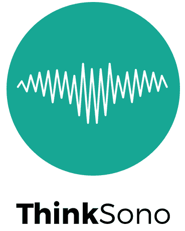

# ASMUS Workshop '21

 

**The 2nd International Workshop of Advances in Simplifying Medical UltraSound (ASMUS) - a workshop held in conjunction with [MICCAI 2021](https://www.miccai2021.org/), the 24th International Conference on Medical Image Computing and Computer Assisted Intervention.**

**ASMUS is the offical workshop of the [MICCAI Special Interest Group on Medical Ultrasound](home).**

>ASMUS is now accepting full-length research papers; submit your paper [here](https://ocs.springer.com/ocs/home/ASMUS2021). **The submission deadline is 25 June 2021.**

## Call for Papers

Papers will consist of maximum 8 pages (text, figures and tables) + up to 2 pages for references only. They are to be submitted electronically in [Springer LNCS (Lecture Notes in Computer Science) style](https://www.springer.com/gp/computer-science/lncs/conference-proceedings-guidelines) and are subject to double blind review. Please submit your work via the [Springer OCS portal](https://ocs.springer.com/ocs/home/ASMUS2021).

The papers will be evaluated by external reviewers and our organizing committee for inclusion in the workshop as a presentation (oral or poster). Accepted full-length manuscripts will be published with Springer LNCS and the best papers will be selected for industry-sponsored awards. Original research contributions are invited. Proof-of-concept research from novel research directions is also encouraged.

One of the popular features of ASMUS 2020, live demonstrations, will be repeated in ASMUS 2021. Capitalising on the unique real-time and portability aspects of ultrasound-based applications, we plan for live demonstrations covering AI, interventional and robotics areas. All accepted papers will be offered the option to present a live demonstration.

| Workshop Timeline |                            |
| ----------------- | -------------------------- |
| June 25 2021      | Paper Submission Deadline  |
| July 16 2021      | Notification of Acceptance |
| July 30 2021      | Camera Ready Submission    |
| September 27 2021 | ASMUS Workshop             |

>For more information, see the full [Call for Papers](/files/ASMUSCallForPapers2021.pdf ':ignore').

## Program

**The full day ASMUS workshop will take place on 27th September 2021, and include live practical technology demonstrations, paper presentations, Q&A sessions, and keynote talks.**

ASMUS 2021 aims to provide an intellectually stimulating forum to bring together the international MICCAI research community working towards the next generation of medical ultrasound imaging methods, systems and practices. 

In this exciting era for medical ultrasound, recent developments in deep learning (artificial intelligence) and medical robotics have started to show clinically measurable improvement in assisting ultrasound examinations, ultrasound-guided interventions and surgery. This year, ASMUS is soliciting submissions, including work from the following areas:

### Ultrasound Assisted by Artificial Intelligence and Medical Robotics:
- Ultrasound imaging with robotic (automated) assistance
- Machine learning methods in ultrasound analysis and guidance
- Automated interpretation and measurement for ultrasound
- Ultrasound quality and skills assessment

### Multimodality Ultrasound Imaging:
- Ultrasound with other non-imaging sensory information, e.g. positional and eye tracking
- Ultrasound with another pre-/intra-procedural imaging, e.g. camera videos, CT, MR, fluorescence
- Different modes of ultrasound imaging, e.g. photoacoustic, Doppler, functional ultrasound, tissue quantification

### Applications:
- Global healthcare
- Training sonographers and other users
- Assisting non-expert healthcare professionals
- Point-of-care ultrasound systems and scenarios
- Assisting surgery and interventions
- Streamlining clinical ultrasound workflow
- Sonography data science

## Keynote Speakers
TBA - Please check back soon for more information.

## Organizers

### Chairs
* Alison Noble (Co-chair, University of Oxford, UK) 
* Stephen Aylward (Co-chair, Kitware, USA) 

### Organising Committee
* Ana Namburete (University of Oxford, UK)
* Andy King (King’s College London, UK)
* Bernhard Kainz (Imperial College London, UK)
* Dong Ni (Shenzhen University, China) 
* Ekaterina Zilonova (KU Leuven, Belgium)
* Emad Boctor (Johns Hopkins University, USA)
* Parvin Mousavi (Queen’s University, Canada)
* Purang Abolmaesumi (University of British Columbia, Canada) 
* Thomas van den Heuvel (Radboud University Nijmegen, Netherlands)
* Wolfgang Wein (ImFusion, Germany)

### Delivery Team

* Yipeng Hu | Delivery Lead (University College London, UK)
* Su-Lin Lee | Delivery Co-lead (University College London, UK)
* Alex Grimwood | Program Chair (University College London, UK)
* Zhe Min | Program Co-Chair (University College London, UK)
* Zachary Baum | Demonstrations Chair (University College London, UK)

### Advisory Board
* Chris de Korte (Radboud University Nijmegen, Netherlands) 
* Gabor Fichtinger (Queen’s University, Canada) 
* Jan d’Hooge (KU Leuven, Belgium) 
* Kawal Rhode (King’s College London, UK) 
* Nassir Navab (Technical University of Munich, Germany) 
* Russ Taylor (Johns Hopkins University, USA) 

## Sponsorship

  
  

>Interested in sponsoring ASMUS 2021? See our [Sponsorship Package](/files/ASMUSSponsorship2021.pdf ':ignore') for more information.

---

  

