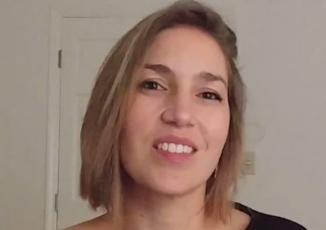
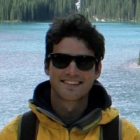
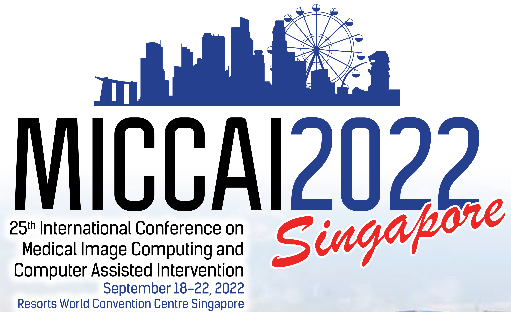

# ASMUS Workshop '22

 

**The 3rd International Workshop of Advances in Simplifying Medical UltraSound (ASMUS) - a workshop held in conjunction with [MICCAI 2022](https://conferences.miccai.org/2022/), the 25th International Conference on Medical Image Computing and Computer Assisted Intervention.**

**ASMUS is the offical workshop of the [MICCAI Special Interest Group on Medical Ultrasound](home).**

> **The ASMUS Workshop starts on September 18th at 9:00 SGT! [View the full program](/files/program2022.pdf ':ignore').**

> Proceedings of the 3rd International Workshop of Advances in Simplifying Medical Ultrasound (ASMUS) are available to download through [this link](https://link.springer.com/book/9783031169021) free of charge for ASMUS participants until October 15th 2022.

## Call for Papers

Papers will consist of maximum 8 pages (text, figures and tables) + up to 2 pages for references only. They are to be submitted electronically in [Springer LNCS (Lecture Notes in Computer Science) style](https://www.springer.com/gp/computer-science/lncs/conference-proceedings-guidelines) and are subject to double blind review. Information on submission to follow.

The papers will be evaluated by external reviewers and our organizing committee for inclusion in the workshop as a presentation (oral or poster). Accepted full-length manuscripts will be published with Springer LNCS and the best papers will be selected for industry-sponsored awards. Original research contributions are invited. Proof-of-concept research from novel research directions is also encouraged.

One of the popular features of ASMUS, live demonstrations, will return for ASMUS 2022. Capitalising on the unique real-time and portability aspects of ultrasound-based applications, we plan for live demonstrations covering AI, interventional and robotics areas. All accepted papers will be offered the option to present a live demonstration.

You may start the submission process at [Springer Nature EquinOCS](https://equinocs.springernature.com/home). E-Mail registration required prior to submission, which can be accessed by clicking the "REGISTER NOW" button on the previous link. If you have any issues registering or with the submission process, please contact the PC Chairs via the platform or via E-Mail.

| Workshop Timeline             |                            |
| ----------------------------- | -------------------------- |
| ~~June 20 2022~~ June 27 2022 | Paper Submission Deadline  |
| ~~July 15 2022~~ July 18 2022 | Notification of Acceptance |
| ~~July 29 2022~~ July 31 2022 | Camera Ready Submission    |
| September 18 2022             | ASMUS Workshop             |

## Program

**The full day ASMUS workshop will take place on September 18th 2022, and include live practical technology demonstrations, paper presentations, Q&A sessions, and keynote talks.**

This year's ASMUS will feature 2 [keynotes](#keynote-speakers), a full session of live demonstrations, and nearly 20 presentations on cutting edge research from international academics and industry leaders. The full program is available [here](/files/program2022.pdf ':ignore'). 

ASMUS 2022 aims to provide an intellectually stimulating forum to bring together the international MICCAI research community working towards the next generation of medical ultrasound imaging methods, systems and practices. 

In this exciting era for medical ultrasound, recent developments in deep learning (artificial intelligence) and medical robotics have started to show clinically measurable improvement in assisting ultrasound examinations, ultrasound-guided interventions and surgery. This year, ASMUS is soliciting submissions, including work from the following areas:

### Ultrasound Assisted by Artificial Intelligence and Medical Robotics:
- Ultrasound imaging with robotic (automated) assistance
- Machine learning methods in ultrasound analysis and guidance
- Automated interpretation and measurement for ultrasound
- Ultrasound quality and skills assessment

### Multimodality Ultrasound Imaging:
- Ultrasound with other non-imaging sensory information, e.g. positional and eye tracking
- Ultrasound with another pre-/intra-procedural imaging, e.g. camera videos, CT, MR, fluorescence
- Different modes of ultrasound imaging, e.g. photoacoustic, Doppler, functional ultrasound, tissue quantification

### Applications:
- Global healthcare
- Training sonographers and other users
- Assisting non-expert healthcare professionals
- Point-of-care ultrasound systems and scenarios
- Assisting surgery and interventions
- Streamlining clinical ultrasound workflow
- Sonography data science

## Keynote Speakers

### Dr Marie M. Muller, PhD

#### Associate Professor, Dept. of Mechanical and Aerospace Engineering, North Carolina State University

  

#### *Quantitative lung ultrasound: finding new sources of contrast to detect and quantify lung diseases*

Marie Muller is an Associate Professor in Mechanical and Aerospace Engineering at North Carolina State University. She received her B.S. in Physics from the Pierre et Marie Curie University in Paris, France in 2002, and her Ph.D in Physical Acoustics from the University of Paris, France in 2006. After a postdoctorate at the Erasmus Medical Center in Rotterdam, the Netherlands, she returned to Paris, as an Assistant Professor with the Institut Langevin. In 2014, she moved to North Carolina and joined the Mechanical and Aerospace Engineering department at NCSU. She is also an associate Faculty with the Joint Department of Biomedical Engineering at UNC and NCSU.  

Dr. Muller has pioneered the use of ultrasound multiple scattering to characterize the lung. Her work has been recognized with several awards, including the prestigious Galien Medstartup Award in 2020, in collaboration with E-scopics, the ICU Early Career Award, the Young Investigator Award from the French Society of Acoustics, the PhD thesis award from the French Society of Biological and Medical Engineering and IEEE France Section, the Prize for a Young Parisian female researcher from the City of Paris, and the Stephens award at the International Congress of Ultrasonics. She is a member of IEEE, the Acoustical Society of America, and of the American Institute of Ultrasound in Medicine. She is also a founding member and member of the board of the International Bone Ultrasound Society.

Conventional ultrasound is unsuitable for imaging lung tissue due to the presence of air-filled alveoli, responsible for significant amounts of scattering of ultrasound waves. As a results, conventional ultrasound images of lung tissue are not a visual representation of lung tissue. They are however of some clinical interest, because diseased lungs exhibit typical vertical artifacts on ultrasound images, called B-lines. These B-lines have significant limitation. They are not specific, system-dependent and qualitative. It is therefore necessary to define new source of contrast that would enable the detection and quantification of lung diseases such as pulmonary fibrosis, pulmonary edema, ARDS, etc.. with good specificity. 

We propose to take advantage of ultrasound scattering in lungs, by using it a source of contrast to characterize lung tissue. Healthy lungs are expected to be responsible for larger amounts of scattering than diseased lungs, due to the presence of healthy, air-filled alveoli. In addition, the spatial distribution of alveoli has an impact on scattering patterns. Based on these principles, we demonstrate that it is possible to use ultrasound scattering as a source of contrast to detect and assess the severity of pulmonary fibrosis and pulmonary edema. We also show that it is possible to detect and localize pulmonary nodules in real time, in order to guide nodule resection during thoracic surgery. 

### Dr Ryan Gessner, PhD

#### Co-Founder and General Manager, SonoVol (a PerkinElmer Company)

  

#### *From a graduate student’s idea to a globally deployed instrument: the decade-long journey to democratize the power of ultrasound by creating a robotic imaging scanner for preclinical research*

Ryan Gessner is the General Manager of the PerkinElmer-SonoVol site in Durham, North Carolina. In 2008 he received his B.S. in Physics from the Acadia University in Nova Scotia Canada, and in 2013 his Ph.D. in Biomedical Engineering from the Joint Department of Biomedical Engineering at UNC Chapel Hill and NC State University. In collaboration with his Ph.D. advisor, Dr. Paul Dayton, while he was a graduate student he co-founded a company “SonoVol” (Sono = ultrasound, Vol = 3D volumetric tools) as a channel for commercializing the imaging technologies they had developed in the lab. After his graduation from UNC, Ryan had not yet secured funding for their venture, so he joined the ranks of a local biomedical imaging company in Research Triangle Park: Bioptigen. Prior to its eventual acquisition by Leica Microsystems, Bioptigen offered optical coherence tomography (OCT) products for both preclinical research as well as clinical applications. While there, Ryan observed a trend that most biologically-minded customers (as opposed to engineering customers) didn’t have the computational or analytical expertise to efficiently get quantitative values from their high resolution 3D image data. This led him to support several customers by building custom image analysis tools for their research applications. This realization was foundational during the next chapter of his career.

While working at Bioptigen, Ryan spent his free time on nights and weekends writing research grant proposals to fund the initial prototypes for a commercially deployable 3D ultrasound imaging system. In 2014 SonoVol received their first small business research grant from the National Science Foundation. With this funding, they built an early prototype of what would years later become the Vega imaging system: a high throughput automated scanner for robotic ultrasound imaging. Over the subsequent years, the team steadily grew from 1 to 10 engineers, and continued to support their development efforts through small business innovation research projects (SBIR grants) with collaborations across the country, as well as commercial sales of the instrument. In 2022, the company merged with PerkinElmer (press release link), a global leader in life science tools across many different disease research and drug development application areas. Ryan still oversees operations at their headquarters in Research Triangle Park, as the team supports ongoing R&D efforts for the Vega product and PerkinElmer scales this technology across the globe.

In this talk, Ryan will discuss what it was like to form a startup company based on university licensed intellectual property, develop imaging-based technologies involving both hardware and software components (with the biologist end user in mind), and provide an overview of specific design challenges for their robotic imaging system than addresses a wide array of needs by their customers in the market.
 
## Organizers

### Chairs
* Alison Noble (University of Oxford, UK)
* Stephen Aylward (Kitware, USA)
* Yipeng Hu (University College London, UK)

### Organising Committee
* Ana Namburete (University of Oxford, UK)
* Andy King (King’s College London, UK)
* Bernhard Kainz (Imperial College London, UK)
* Dong Ni (Shenzhen University, China)
* Ekaterina Zilonova (KU Leuven, Belgium)
* Emad Boctor (Johns Hopkins University, USA)
* Parvin Mousavi (Queen’s University, Canada)
* Purang Abolmaesumi (University of British Columbia, Canada)
* Thomas van den Heuvel (Radboud University Nijmegen, Netherlands)
* Wolfgang Wein (ImFusion, Germany)

### Delivery Team
* Su-Lin Lee, Delivery Lead (University College London, UK)
* Zhe Min, Program Co-Chair (University College London, UK)
* Zachary Baum, Program Co-Chair, Demonstrations Chair (University College London, UK)
* Alberto Gomez Herrero, Delivery Team Member (King's College London, UK)
* Hadrien Reynaud, Delivery Team Member (Imperial College London, UK)
* Thomas Day, Delivery Team Member (King's College London, UK)

### Advisory Board
* Chris de Korte (Radboud University Nijmegen, Netherlands)
* Gabor Fichtinger (Queen’s University, Canada)
* Jan d’Hooge (KU Leuven, Belgium)
* Kawal Rhode (King’s College London, UK)
* Nassir Navab (Technical University of Munich, Germany)
* Russ Taylor (Johns Hopkins University, USA)

---

  

