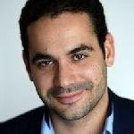

# ASMUS Workshop '24

 

**The 5th International Workshop of Advances in Simplifying Medical UltraSound (ASMUS) - a workshop held in conjunction with [MICCAI 2024](https://conferences.miccai.org/2024/en/default.asp), the 27th International Conference on Medical Image Computing and Computer Assisted Intervention.**

**ASMUS is the official workshop of the [MICCAI Special Interest Group on Medical Ultrasound](home).**

> **The workshop proceedings will be published before the conference starts. Workshop attendees can access the proceedings until four weeks after the conference.**

## Call for Papers

Papers will consist of a maximum of 8 pages (text, figures, and tables) + up to 2 pages for references only.
They are to be submitted electronically in [Springer LNCS (Lecture Notes in Computer Science) style](https://www.springer.com/gp/computer-science/lncs/conference-proceedings-guidelines) and are subject to double-blind review.
The workshop sessions (oral and posters) will be held in person only, and by submitting a paper authors commit to presenting them in person if accepted for publication.

The papers will be evaluated by external reviewers and our organizing committee for inclusion in the workshop as a presentation (oral or poster).
Accepted full-length manuscripts will be published with Springer LNCS, and the best papers will be selected for industry-sponsored awards.
Original research contributions are invited.
Proof-of-concept research from novel research directions is also encouraged.
This year, with MICCAI being held for the first time in Africa, we particularly encourage the submission of research to address problems specific to Africa and low- and middle-income countries.

One of the popular features of ASMUS, live demonstrations, will return for ASMUS 2024.
Capitalizing on the unique real-time and portability aspects of ultrasound-based applications, we plan for live demonstrations covering AI, interventional, and robotics areas.
All accepted papers will be offered the option to present a live demonstration.

You may start submitting the papers at [Springer Nature EquinOCS](https://equinocs.springernature.com/service/ASMUS2024). **Please note that the deadline for paper submission has been extended from June 24th 2024 to June 28th 2024.** E-mail registration is required before submission, which can be accessed by clicking the "Submit now" button on the previous link.
If you have any issues registering or with the submission process, please contact the PC Chairs via the platform or E-Mail.

In this exciting era for medical ultrasound, recent developments in deep learning (artificial intelligence) and medical robotics have started showing clinically measurable improvement in assisting ultrasound examinations, ultrasound-guided interventions, and surgery.
This year, ASMUS is soliciting submissions, including work from the following areas:

### Ultrasound Assisted by Artificial Intelligence and Medical Robotics:

- Ultrasound imaging with robotic (automated) assistance
- Machine learning methods in ultrasound analysis and guidance
- Automated interpretation and measurement for ultrasound
- Ultrasound quality and skills assessment

### Multimodality Ultrasound Imaging:

- Ultrasound with other non-imaging sensory information, e.g. positional and eye tracking
- Ultrasound with another pre-/intra-procedural imaging, e.g. camera videos, CT, MR, fluorescence
- Different modes of ultrasound imaging, e.g. photoacoustic, Doppler, functional ultrasound, tissue quantification

### Applications:

- Global healthcare
- Training sonographers and other users
- Assisting non-expert healthcare professionals
- Point-of-care ultrasound systems and scenarios
- Assisting surgery and interventions
- Streamlining clinical ultrasound workflow
- Sonography data science

| Workshop Timeline |                            |
| ----------------- | -------------------------- |
| June 28th 2024    | Paper Submission Deadline  |
| July 10th 2024    | Reviews Due                |
| July 15th 2024    | Notification of Acceptance |
| August 1st 2024   | Camera Ready Submission    |
| October 6th 2024  | ASMUS Workshop             |

All times are in "anywhere on earth".

## Program

**To be confirmed**

## Keynote Speaker

### [Youssef Bouyakhf](https://www.linkedin.com/in/youssef-bouyakhf/?originalSubdomain=uk)

_Title:_ Democratizing access to quality prenatal ultrasound scans: Combining blind sweeps and Point of Care (POC) Ultrasound, how promising is the approach?

_Abstract:_ To be confirmed

_Bio:_ Born and raised in Morocco, Youssef has studied in France and received a double degree Master in Engineering and Business between French Grandes Ecole, Ecole Centrale Paris and ESSEC Business School. After a few years in Investment Banking in London, Youssef has shifted his focus more on building new ventures than investing in established ones. He has been part of the founding Team of AIOX Labs, the spin of the first AI Lab in Morocco, Mohamed V Artificial Intelligence Lab, LIMIARF. Since then AIOX Labs has given birth to many project including DeepEcho, an AI for Medial Imaging start-up focusing on improving prenatal care. Youssef Bouyakhf is currently the CEO of DeepEcho who is a building an innovative solution to help clinicians improve fetal ultrasound diagnosis.

## Challenge

### [Trackerless 3D Freehand Ultrasound Reconstruction Challenge](https://github-pages.ucl.ac.uk/tus-rec-challenge/)

Reconstructing 2D Ultrasound (US) images into a 3D volume enables 3D representations of anatomy to be generated which are beneficial to a wide range of downstream tasks such as quantitative biometric measurement, multimodal registration, 3D visualization, and interventional guidance.
Although substantive progress has been made recently through non-deep-learning- and deep-learning-based approaches, this application is still challenging due to 1) inherent accumulated error - frame-to-frame transformation error will be accumulated through time when reconstructing long sequence of US frames, and 2) a lack of publicly-accessible data with synchronized spatial location, often obtained from tracking devices, for benchmarking the performance and for training learning-based methods.
The TUS-REC challenge aims to provide a benchmark for freehand US reconstruction with publicly available in vivo US data from the forearms of one hundred volunteers, using multiple predefined scanning protocols, targeted to improve the reconstruction performance in this challenging task.
The outcome of the challenge includes 1) open-sourcing the first largest tracked US datasets with accurate positional information; and 2) establishing one of the first benchmarks for 3D US reconstruction, suitable for modern learning-based data-driven approaches.

## Organizers

### Chairs

- Andy King (Chair, King's College London, UK)
- Ana Namburete (Co-Chair, University of Oxford, UK)
- Bishesh Khanal (Co-Chair, NAAMII, Nepal)
- Alberto Gomez (Co-Chair, Ultromics, UK)

### Organising Committee

- Alison Noble (University of Oxford, UK)
- Stephen Aylward (Kitware, US)
- Bernhard Kainz (FAU Erlangen-Nürnberg, DE, and Imperial College London, UK)
- Yipeng Hu (University College London, UK)
- Purang Abolmaesumi (University of British Columbia, CA)
- Dong Ni (Shenzhen University, CN)
- Emad Boctor (Johns Hopkins University, US)
- Thomas van den Heuvel (Radboud University, NL)
- Wolfgang Wein (ImFusion, DE)
- Parvin Mousavi (Queen’s University, CA)
- Veronika Zimmer (Technical University of Munich, DE)
- Qingjie Meng (University of Birmingham, UK)

### Delivery Team

- Zhen Yuan (King’s College London, UK)
- Rabin Adhikari (NAAMII, Nepal)
- Kit Bransby (Ultromics, UK)

### Advisory Board

- Gabor Fichtinger (Queen’s University, CA)
- Kawal Rhode (King’s College London, UK)
- Russ Taylor (Johns Hopkins University, USA)
- Chris de Korte (Radboud University Nijmegen, NL)
- Nassir Navab (Technical University of Munich, DE)
- Reza Razavi (King’s College London, UK)
- Joseph V. Hajnal (King’s College London, UK)
- Babacar Diao (Cheikh Anta Diop University of Dakar, Senegal)
