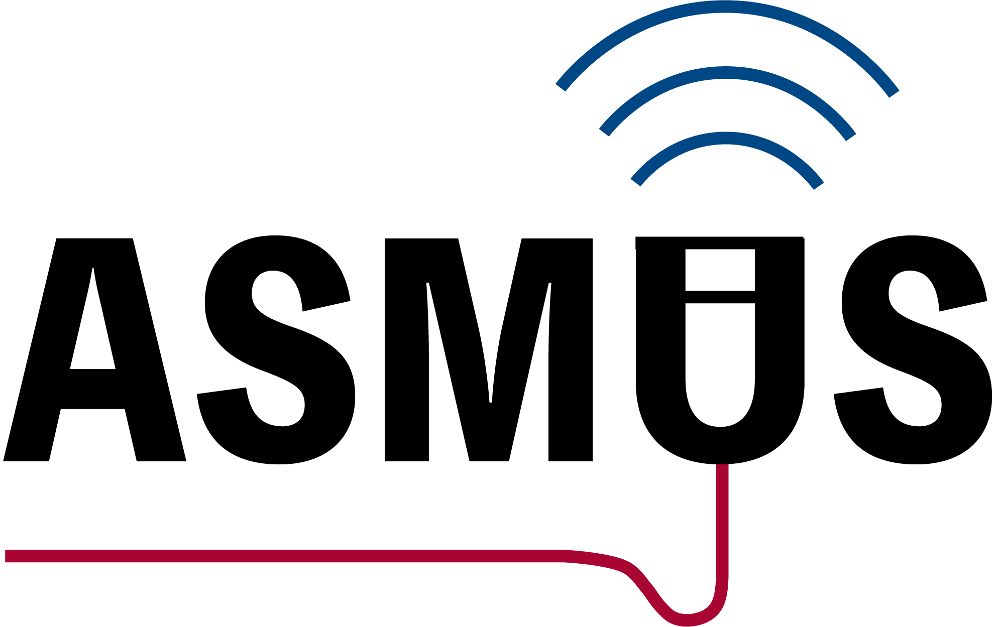
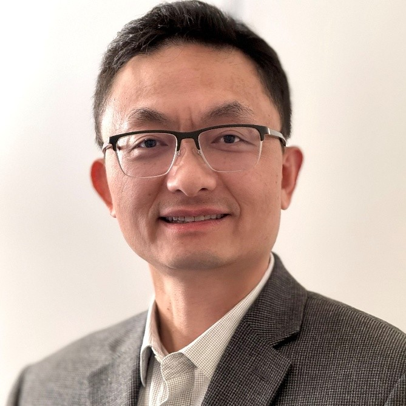
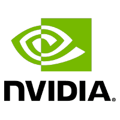

# ASMUS Workshop '25

 

**The 6th International Workshop of Advances in Simplifying Medical UltraSound (ASMUS) - a workshop held in conjunction with [MICCAI 2025](https://conferences.miccai.org/2025/en/default.asp), the 28th International Conference on Medical Image Computing and Computer Assisted Intervention.**

**ASMUS is the official workshop of the [MICCAI Special Interest Group on Medical Ultrasound](https://miccai-ultrasound.github.io/).**

## Call for Papers

**NEWS: We are happy to share with you that an interesting J-BHI special issue on [Next-Generation AI-Powered Medical Ultrasound Imaging: Methods and Systems](https://www.embs.org/jbhi/special-issues/) is newly launched, which aligns quite well with the ASMUS workshop. Extension of the workshop papers are encouraged to be submitted to this special issue.**

Papers will consist of a maximum of 8 pages (text, figures, and tables) + up to 2 pages for references only.
They are to be submitted electronically in [Springer LNCS (Lecture Notes in Computer Science) style](https://www.springer.com/gp/computer-science/lncs/conference-proceedings-guidelines) and are subject to double-blind review.
The workshop sessions (oral and posters) will be held in person only, and by submitting a paper authors commit to presenting them in person if accepted for publication.

The papers will be evaluated by external reviewers and our organizing committee for inclusion in the workshop as a presentation (oral or poster).
Accepted full-length manuscripts will be published with Springer LNCS, and the best papers will be selected for industry-sponsored awards.
Original research contributions are invited.
Proof-of-concept research from novel research directions is also encouraged.
This year, we encourage submissions exploring emerging frontiers in ultrasound research, with special emphasis on: 1) clinical-guided design in ultrasound workflow, and 2) large multimodal foundation model-driven AI technologies in ultrasound.

Building on the success of previous interactive live demonstrations, ASMUS 2025 will continue this feature to showcase cutting-edge ultrasound innovations. We invite researchers to demonstrate novel systems leveraging ultrasound's unique real-time capabilities and clinical portability. All accepted papers will be offered the option to present a live demonstration.

The submission system will be open on May 10th, 2025. You may start submitting the papers at [Springer Nature Meteor](https://meteor.springer.com/ASMUS2025). **Please note that the deadline for paper submission is June 28th 2025, 23:59 PT.** E-mail registration is required before submission, which can be accessed by clicking the "here" button on the previous link.
If you have any issues registering or with the submission process, please contact the PC Chairs via the platform or E-Mail.

This multidisciplinary workshop will foster cross-sector collaboration, rigorously reviewing, publishing, and engaging participants in discussions about cutting-edge advancements. Contributors from academia, underserved regions, industry, and clinical settings are invited to share insights. Selected full papers will appear in a Springer publication, with top submissions receiving awards supported by industry partners. We welcome original research submissions and actively seek proof-of-concept studies pioneering innovative methodologies. Key focus areas include:

### Ultrasound Assisted by Artificial Intelligence and Medical Robotics:

- Machine learning methods in ultrasound analysis, dignosis, and guidance
- Automated interpretation and measurement for ultrasound
- Ultrasound quality and skill assessment
- Human-in-the-loop clinical decision support
- Clinical-guided design in ultrasound workflow
- Large multimodal foundation model-driven AI technologies in ultrasound

### Multimodality Ultrasound Imaging:

- Ultrasound with other non-imaging sensory information, e.g. positional and eye tracking
- Ultrasound with another pre-/intra-procedural imaging, e.g. camera videos, CT, MR, fluorescence
- Different modes of ultrasound imaging, e.g. photoacoustic, Doppler, functional ultrasound, tissue quantification

### Applications:

- Global healthcare
- Training sonographers and other users
- Assisting non-expert healthcare professionals
- Point-of-care ultrasound systems and scenarios
- Assisting surgery and interventions
- Streamlining clinical ultrasound workflow
- Sonography data science and ultrasound foundation model pre-training and fine-tuning

| Workshop Timeline  |                            |
| -----------------  | -------------------------- |
| June 28th 2025     | Paper Submission Deadline  |
| July 12th 2025     | Reviews Due                |
| July 19th 2025     | Notification of Acceptance |
| August 6th 2025    | Camera Ready Submission    |
| September 27th 2025| ASMUS Workshop             |

## Program

08:00–08:05	Introduction and Opening

### 🟩 Session 1: Oral Session 1 – *Segmentation, Imaging and Synthesis*  
**Session Chairs:** Wufeng Xue and Ruobing Huang

- 08:05–08:17  
  **Motion-enhanced Cardiac Anatomy Segmentation via an Insertable Temporal Attention Module**  
  *Md Kamrul Hasan, Guang Yang, Choon Hwai Yap*

- 08:17–08:29  
  **DiffUS: Differentiable Ultrasound Rendering from Volumetric Imaging**  
  *Noe Bertramo, Gabriel Duguey, and Vivek Gopalakrishnan*

- 08:29–08:41  
  **TREAT-Net: Tabular-Referenced Echocardiography Analysis for Acute Coronary Syndrome Treatment Prediction**  
  *Diane Kim, Nguyen Nhat Minh To, Sherif Abdalla, Teresa Tsang, Purang Abolmaesumi, Christina Luong*

- 08:41–08:53  
  **DiFUSAL: Diffusion-Based Fetal Ultrasound Synthesis with Active Learning**  
  *Maryam Arjemandi, Salma Hassan, Hu Wang, Mohammad Yaqub, Saudabi Valappil*

- 08:55–09:35  
  **Keynote: Towards Cardiovascular AI**  
  *David Ouyang (Kaiser Permanente)*

- 09:35–10:00  
  **Invited Technical Report**  
  *Stephen Aylward (NVIDIA)*

- 10:00–10:40  
  **Coffee Break + Posters**

### 🟨 Session 2 Title: Oral Session 2 - *Registration and Reconstruction*
**Session Chairs:** Wufeng Xue and Ruobing Huang

- 10:40–10:52  
  **Robust rigid MRI-TRUS registration using attention-CNN and ICP**  
  *Manasi Kattel, Benjamin Billot, Federica Facente, Herve Dellingette, Nicholas Ayache*

- 10:52–11:04  
  **Det-SAMReg: Few-Shot Medical Image Registration using Vision Foundation Models**  
  *Mengting Yang, Qilin Wang, Shiqi Huang, Wen Yan, Yipeng Hu, Zhe Min*

- 11:04–11:16  
  **DualTrack: Sensorless 3D Ultrasound needs Local and Global Context**  
  *Paul Wilson, Matteo Ronchetti, Ruediger Goebl, Viktoria Markova, Sebastian Rosenzweig, Raphael Prevost, Parvin Mousavi, Oliver Zettinig*

- 11:16–11:28  
  **Modulated INR with Prior Embeddings for Ultrasound Imaging Reconstruction**  
  *Remi Delaunay, Christoph Hennersperger, Stefan Wörz*

- 11:30–12:10  
  **Keynote: Transforming Healthcare with AI – Scalable AI-powered Ultrasound Solutions for Resource-Constrained Settings**  
  *Wei Luo (Gates Foundation)*

- 12:10–12:30  
  **Summary and Awards**

- 12:30–13:30  
  **Lunch Break**

### 🟪 Session 3 Title: Challenge Session 1 - *Landmark Detection Challenge for Intrapartum Ultrasound Measurement Meeting the Actual Clinical Assessment of Labor Progress (IUGC)*
**Session Chairs:** Jieyun Bai

| Time               |                                                  |
| -----------------  | -------------------------------------------------|
| 13:30-13:45        | Introduction to the Challenge                    |
| 13:45-15:15        | Winning Teams' Technical Presentations (6 teams) |
| 15:15-15:30        | Award Ceremony and Group Photo                   |
| 15:30-16:00        | Coffee Break                                     |

### 🟫 Session 4 Title: Challenge Session 2 - *Trackerless 3D Freehand Ultrasound Reconstruction Challenge (TUS-REC)*
**Session Chairs:** Qi Li

| Time               |                                           |
| -----------------  | ------------------------------------------|
| 16:00-16:10        | Introduction to the TUS-REC2025 Challenge |
| 16:10-17:00        | Presentations by competing teams          |
| 17:00-17:05        | Results summary                           |
| 17:05-17:15        | Awards ceremony                           |

### 🧾 Posters

- **VidFuncta: Towards Generalizable Neural Representations for Ultrasound Videos**  
  *Wolleb, J., Bieder, F., Friedrich, P., Tagare, H., Papademetris, X.*

- **From Transthoracic to Transesophageal: Cross-Modality Generation using LoRA Diffusion**  
  *Oladokun, E., Ou, Y., Novikova, A., Kulikova, D., Thomas, S., Sprem, J., Grau, V.*

- **L-FUSION: Laplacian Fetal Ultrasound Segmentation & Uncertainty Estimation**  
  *Müller, J., Wright, R., Day, T., Venturini, L., Budd, S., Reynaud, H., Hajnal, J., Razavi, R., Kainz, B.*

- **3D Heart Reconstruction from Sparse Pose-agnostic 2D Echocardiographic Slices**  
  *Chen, Z., Chen, J., Zhuo, W., Wufeng, X., Ni, D.*

- **3D Ultrasound Volume Reconstruction using a CNN-Transformer model and IMU data**  
  *Wijkhuizen, M., Adriaans, C., Karnenbeek, L., Natali, T., Ruers, T., Geldof, F., Dashtbozorg, B.*

- **Optimization-Based Calibration for Intravascular Ultrasound Volume Reconstruction**  
  *Beaudet, K., El hadramy, S., Cattin, P., Verde, J., Cotin, S.*

- **Anatomically Constrained Transformers for Cardiac Amyloidosis Classification**  
  *Thorley, A., Chartsias, A., Strom, J., Lang, R., Slivnick, J., O'Driscoll, J., Sharma, R., Kotecha, D., Duan, J., Gomez, A.*

- **D.A.R.K.: Dynamic Graphs based Angle-aware Registration of Knee Ultrasound Point Clouds**  
  *Injune Hwang, Stephen Mellon, Dr. Jack Tu*

- **The Impact of Biomechanical Quantities on PINNs-based Medical Image Registration**  
  *Shixing Ma, Zhaoxi Lin, Xinzhe Du, Yipeng Hu, Zhe Min*

- **Diffusion-based Iterative Counterfactual Explanations for Fetal Ultrasound Image Quality Assessment**  
  *Pegios, P., Lin, M., Weng, N., Søndergaard Svendsen, M., Bashir, Z., Bigdeli, S., Christensen, A., Tolsgaard, M., Feragen, A.*

- **Learning to Stop: Reinforcement Learning for Efficient Patient-Level Echocardiographic Classification**  
  *Cho Kim, W., Oliveira, J., Thorley, A., Beqiri, A., O'Driscoll, J., Slivnick, J., Strom, J., Sharma, R., Lang, R., Gomez, A., Chartsias, A.*

- **WiseLVAM: A Novel Framework For Left Ventrical Automatic Measurements**  
  *Kumar Singh, D., Cao, Q., Thomas, S., Boubekki, A., Jenssen, R., Kampffmeyer, M.*

- **UGFNet: Uncertainty-Guided Graph Neural Network with Frequency-Aware Feature Fusion for Breast Ultrasound Segmentation**  
  *Kong, H., Shin, J.*

- **HiProtoNet: Hyperbolic Hierarchy-aware Part Prototypes for Aortic Stenosis Severity Classification**  
  *Vaseli, H., Wu, V., Kim, D., Tsang, M., Gu, A., Luong, C., Abolmaesumi, P., Tsang, T.*

- **COVID-19 Severity Prediction from Lung Ultrasound via Dynamic Gated Multi-Instance Learning**  
  *Lin, C., Xue, W., Ni, D., Zhou, G.*

- **Guide2Heart: Proximity Guidance for Standard Echocardiographic View**  
  *Gajendra Singh, Aiman Farooq, Azad Singh, Deepak Mishra, Rahul Choudhary, Pushpinder Singh Khera*

## Keynote Speaker

### [David Ouyang](https://douyang.github.io/)

**Keynote: Towards Cardiovascular AI**

_Bio:_ David Ouyang, MD, is a research scientist at the Kaiser Permanente Northern California Division of Research and a non-invasive cardiologist and echocardiographer at Kaiser Permanente Santa Clara Medical Center. Dr. Ouyang’s group works on applications of deep learning, computer vision, and the statistical analysis of large datasets within cardiovascular medicine. His work has been published in Nature, Nature Medicine, NEJM AI, Circulation, JACC, JAMA Cardiology, EHJ, and other venues. He is also a Deputy Editor for New England Journal of Medicine (NEJM) AI.

A physician-scientist and statistician with a focus on cardiology and imaging, Dr. Ouyang majored in statistics at Rice University, obtained his MD at the University of California, San Francisco, and received post-graduate medical education in internal medicine, cardiology, and a postdoctoral fellowship in computer science and biomedical data science at Stanford University. He is the recipient of an NHLBI K99/R00 and two R01 grants focused on applications of computer vision in echocardiography. He is the Principal Investigator (PI) or Co-Investigator on multiple investigator-initiated pragmatic clinical trials of AI in cardiovascular medicine.

### Wei Luo (Gates Foundation)

**Keynote: Transforming Healthcare with AI – Scalable AI-powered Ultrasound Solutions for Resource-Constrained Settings**

_Bio:_ Wei Luo is a Senior Officer for AI and Medical Devices at the Gates Foundation, overseeing innovation and product development investments in maternal and newborn health. Wei brings more than 20 years of product and technology experience and expertise across the private and nonprofit sectors, particularly in the areas of Ultrasound, AI/ML, and medical devices. Most recently, Wei served as Senior Director of Product Management at Global Health Labs, where he led the product development of AI-enabled medical devices designed for non-specialist health workers in low-resource settings. His work included an AI-enabled OB Ultrasound product that enables nurses and midwives to do earlier identification of high-risk pregnancies. He also led the commercialization strategy and plan of a cervical cancer screening tool using Edge AI in India and Africa.

Previously, Wei held senior roles at Microsoft, where he led AI/ML feature development for Windows, and the Voice Clarity feature launched in 2022 as a premium communication experience for Teams. Prior to Microsoft, he worked as a Senior Director of Product Development at Siemens Healthineers from 2014 -2019, directing the development of medical ultrasound devices and solutions in Intracardiac Echocardiography (ICE) as well as Cardiology and General Imaging, with multiple Class-II and Class-III devices released to the market. Earlier in his career, Wei worked for GE and GE Healthcare for 9 years, spearheading the development and release of the first e4D curved matrix array for Voluson E10 OB/GYN imaging system in 2014 that enabled early fetal heart diagnosis.

## Challenge

### [Trackerless 3D Freehand Ultrasound Reconstruction Challenge](https://github-pages.ucl.ac.uk/tus-rec-challenge/)

Reconstructing 2D Ultrasound (US) images into a 3D volume enables 3D representations of anatomy to be generated which are beneficial to a wide range of downstream tasks such as quantitative biometric measurement, multimodal registration, 3D visualization, and interventional guidance.
Although substantive progress has been made recently through non-deep-learning- and deep-learning-based approaches, this application is still challenging due to 1) inherent accumulated error - frame-to-frame transformation error will be accumulated through time when reconstructing long sequence of US frames, and 2) a lack of publicly-accessible data with synchronized spatial location, often obtained from tracking devices, for benchmarking the performance and for training learning-based methods.
The TUS-REC challenge aims to provide a benchmark for freehand US reconstruction with publicly available in vivo US data from the forearms of one hundred volunteers, using multiple predefined scanning protocols, targeted to improve the reconstruction performance in this challenging task.
The outcome of the challenge includes 1) open-sourcing the first largest tracked US datasets with accurate positional information; and 2) establishing one of the first benchmarks for 3D US reconstruction, suitable for modern learning-based data-driven approaches.

### [Landmark Detection Challenge for Intrapartum Ultrasound Measurement Meeting the Actual Clinical Assessment of Labor Progress](https://www.codabench.org/competitions/7108/)

A cornerstone of ultrasound-based labor assessment is the identification of landmarks in intrapartum images, which form the basis for calculating key parameters like the angle of progression (AoP). The AoP provides critical insight into fetal head descent and rotation during labor and directly influences decisions about interventions. However, obtaining consistent landmark annotations remains a major challenge: current workflows require time-consuming manual analysis by experienced obstetricians, and intra-/inter-observer variability compromises measurement reliability. This bottleneck highlights the urgent need for automated solutions to standardize intrapartum assessments and align with the LCG's goal of enhancing care quality.
To address this need, the challenge tasks participants with developing a fully automated fetal biometry method. The solution should identify three key anatomical landmarks in intrapartum ultrasound images and get the AoP.

## Sponsors

### [NVIDIA](https://www.nvidia.com/)

### [度影医疗(RayShape)](https://rayshape.com/)

## Organizers

### Chairs

- Dong Ni (Chair, Shenzhen University, CN)
- Alison Noble (Co-Chair, University of Oxford, UK)

### Organising Committee

- Dong Ni (Shenzhen University, CN)
- Alison Noble (University of Oxford, UK)
- Stephen Aylward (Kitware, USA)
- Yipeng Hu (Univ. College London, UK)
- Purang Abolmaesumi (Univ. of British Columbia, CA)
- Alberto Gomez (Ultromics, UK)
- Andrew King (King’s College London, UK)
- Bishesh Khanal (NAAMII, Nepal)
- Ana Namburete (Univ. of Oxford, UK)
- Bernhard Kainz (FAU Erlangen-Nürnberg, DE, and Imperial College London, UK)
- Emad Boctor (Johns Hopkins Univ., USA)
- Thomas van den Heuvel (Radboud Univ., NL)
- Wolfgang Wein (ImFusion, DE)
- Parvin Mousavi (Queen’s Univ., CA)
- Veronika Zimmer (Technical Univ. of Munich, DE)
- Qingjie Meng (University of Birmingham, UK)

### Delivery Team

- Ruobing Huang (Program Chair, Shenzhen University, CN)
- Wufeng Xue (Program Chair, Shenzhen University, CN)
- Wei Wang (Clinical Chair, Sun Yat-sen University, CN)
- Jieyun Bai (Challenge Chair, Jinan University, CN)
- Qi Li (Challenge Chair, Univ. College London, UK)
- Jun Cheng (Communication Chair, Shenzhen University, CN)
- Xin Yang (Demonstrations Chair, Shenzhen University, CN)
- Yi Wang (Web Chair, Shenzhen University, CN)

### Advisory Board

- Gabor Fichtinger (Queen’s Univ., Canada)
- Kawal Rhode (King’s College London, UK)
- Russ Taylor (Johns Hopkins Univ., USA)
- Chris de Korte (Radboud Univ. Nijmegen, NL)
- Nassir Navab (Technical Univ. of Munich, Germany)
- Reza Razavi (King’s College London, UK)
- Joseph Hajnal (King’s College London, UK)

