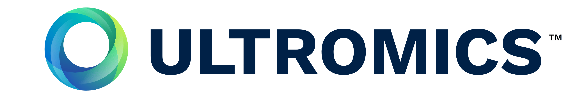

# ASMUS Workshop '25

 

**The 5th International Workshop of Advances in Simplifying Medical UltraSound (ASMUS) - a workshop held in conjunction with [MICCAI 2025](https://conferences.miccai.org/2025/en/default.asp), the 28th International Conference on Medical Image Computing and Computer Assisted Intervention.**

**ASMUS is the official workshop of the [MICCAI Special Interest Group on Medical Ultrasound](home).**

## Call for Papers

Papers will consist of a maximum of 8 pages (text, figures, and tables) + up to 2 pages for references only.
They are to be submitted electronically in [Springer LNCS (Lecture Notes in Computer Science) style](https://www.springer.com/gp/computer-science/lncs/conference-proceedings-guidelines) and are subject to double-blind review.
The workshop sessions (oral and posters) will be held in person only, and by submitting a paper authors commit to presenting them in person if accepted for publication.

The papers will be evaluated by external reviewers and our organizing committee for inclusion in the workshop as a presentation (oral or poster).
Accepted full-length manuscripts will be published with Springer LNCS, and the best papers will be selected for industry-sponsored awards.
Original research contributions are invited.
Proof-of-concept research from novel research directions is also encouraged.
This year, we encourage submissions exploring emerging frontiers in ultrasound research, with special emphasis on: 1) clinical-guided design in ultrasound workflow, and 2) large multimodal foundation model-driven AI technologies in ultrasound.

Building on the success of previous interactive live demonstrations, ASMUS 2025 will continue this feature to showcase cutting-edge ultrasound innovations. We invite researchers to demonstrate novel systems leveraging ultrasound's unique real-time capabilities and clinical portability. All accepted papers will be offered the option to present a live demonstration.

Submission will be open on May 10th, 2025. You may start submitting the papers at [Springer Nature](https://meteor.springer.com/ASMUS2025). **Please note that the deadline for paper submission is June 28th 2025, 23:59 PT.** E-mail registration is required before submission, which can be accessed by clicking the "Submit now" button on the previous link.
If you have any issues registering or with the submission process, please contact the PC Chairs via the platform or E-Mail.

This multidisciplinary workshop will foster cross-sector collaboration, rigorously reviewing, publishing, and engaging participants in discussions about cutting-edge advancements. Contributors from academia, underserved regions, industry, and clinical settings are invited to share insights. Selected full papers will appear in a Springer publication, with top submissions receiving awards supported by industry partners. We welcome original research submissions and actively seek proof-of-concept studies pioneering innovative methodologies. Key focus areas include:

### Ultrasound Assisted by Artificial Intelligence and Medical Robotics:

- Machine learning methods in ultrasound analysis, dignosis, and guidance
- Automated interpretation and measurement for ultrasound
- Ultrasound quality and skill assessment
- Human-in-the-loop clinical decision support
- Clinical-guided design in ultrasound workflow
- Large multimodal foundation model-driven AI technologies in ultrasound

### Multimodality Ultrasound Imaging:

- Ultrasound with other non-imaging sensory information, e.g. positional and eye tracking
- Ultrasound with another pre-/intra-procedural imaging, e.g. camera videos, CT, MR, fluorescence
- Different modes of ultrasound imaging, e.g. photoacoustic, Doppler, functional ultrasound, tissue quantification

### Applications:

- Global healthcare
- Training sonographers and other users
- Assisting non-expert healthcare professionals
- Point-of-care ultrasound systems and scenarios
- Assisting surgery and interventions
- Streamlining clinical ultrasound workflow
- Sonography data science and ultrasound foundation model pre-training and fine-tuning

| Workshop Timeline  |                            |
| -----------------  | -------------------------- |
| June 28th 2025     | Paper Submission Deadline  |
| July 12th 2025     | Reviews Due                |
| July 19th 2025     | Notification of Acceptance |
| August 6th 2025    | Camera Ready Submission    |
| September 27th 2025 (TBD)| ASMUS Workshop    |

## Program

8:00-8:10 Introduction 

8:10-8:50 Keynote - Youssef Bouyakhf

8:50-9:30 Orals 1 – AI Methodology to Simplify Ultrasound
- Zhang et al, Fetal Ultrasound Video Representation Learning using Contrastive Rubik’s Cube Recovery 
- Bransby et al, Multi-Site Class-Incremental Learning with Weighted Experts in Echocardiography 
- Dulmer et al, PHOCUS: Physics-Based Deconvolution for Ultrasound Resolution Enhancement 

9:30-10:00 Poster + demo teasers
- Posters:
  - De Vyver at al, Regional quality estimation for echocardiography using deep learning
  - Colussi et al, LoRIS - Weakly-supervised Anomaly Detection for Ultrasound Images 
  - Salmanpour et al, Do High-Performance Image-to-Image Translation Networks Enable the Discovery of Radiomic Features? Application to MRI Synthesis from Ultrasound in Prostate Cancer 
  - Leenings et al, C-TRUS: A Novel Dataset and Initial Benchmark For Colon Wall Segmentation in Transabdominal Ultrasound 
  - Islam et al, Label Dropout: Improved Deep Learning Echocardiography Segmentation Using Multiple Datasets With Domain Shift and Partial Labelling 
  - Szijártó et al, Masked autoencoders for medical ultrasound videos using ROI-aware masking 
  - Chen et al, PIPsUS: Self-Supervised Point Tracking in Ultrasound 
  - Olsen et al, Unsupervised Detection of Fetal Brain Anomalies using Denoising Diffusion Models 
  - Kafaei Zad Tehrani et al, Unsupervised Physics-Inspired Shear Wave Speed Estimation in Ultrasound Elastography 
  - Vassallo et al, Simplifying Prostate Elastography Using Micro-Ultrasound and Transfer Function Imaging 
  - Alomar et al, Automatic facial axes standardization of 3D fetal ultrasound images 
  - Yang et al, Uncertainty-based Multi-modal Learning for Myocardial Infarction Diagnosis using Echocardiography and Electrocardiograms 
  - Gasser et al, Diffusion Models for Unsupervised Anomaly Detection in Fetal Brain Ultrasound 
  - Andreassen et al, Introducing Anatomical Constraints in Mitral Annulus Segmentation in Transesophageal Echocardiography 
  - Li et al, Interactive Segmentation Model for Placenta Segmentation from 3D Ultrasound images 
  - Léger et al, An Evaluation of Low-Cost Hardware on 3D Ultrasound Reconstruction Accuracy 
  - Banerjee et al, Enhanced Uncertainty Estimation in Ultrasound Image Segmentation with MSU-Net
- Demos:
  - TBC

10:00-10:30 Coffee (posters + demos) 

10:30-10:50 Posters + demos 

10:50-11:15 Orals 2 – Simplifying Ultrasound-Guided Interventions
- Rasheed et al, Intraoperative MR-Ultrasound Image Matching via Texture-invariant Keypoint Descriptors
- Jiang et al, Structure-aware World Model for Probe Guidance via Large-scale Self-supervised Pre-train

11:15-12:00 LMIC panel discussion

12:00-12:15 TUS-REC Challenge Summary 

12:15-12:20 Open US datasets/models initiative summary

12:20-12:30 Closing + awards  

## Keynote Speaker

### [David Ouyang](https://www.linkedin.com/in/youssef-bouyakhf/?originalSubdomain=uk)

_Title:_ Democratizing access to quality prenatal ultrasound scans: Combining blind sweeps and Point of Care (POC) Ultrasound, how promising is the approach?

_Bio:_ I am a cardiologist and researcher in the Department of Cardiology and Division of Artificial Intelligence in Medicine at Cedars-Sinai Medical Center. Our group works on applications of deep learning, computer vision, and the statistical analysis of large datasets within cardiovascular medicine. We focus on development (see section 'Precision Phenotyping'), understanding (see section 'Interpretable Medical AI'), and deployment of AI (see section 'AI Clinical Trials'). Our work has been published in Nature, Nature Medicine, NEJM AI, Circulation, JAMA Cardiology, EHJ, and other scientific venues.

As a physician-scientist and statistician with focus on cardiology and imaging, I majored in statistics at Rice University, obtained my MD at UCSF, and received post-graduate medical education in internal medicine, cardiology, and a postdoc in computer science and biomedical data science at Stanford University. As an echocardiographer, I apply deep learning for precision phenotyping in cardiac ultrasound and the deployment and clinicial trials of AI models. We are interested in all forms of cardiovascular data, including ECG, MRI, radiological imaging, and particicularly interested in novel insights from pre-existing data.

## Challenge

### [Trackerless 3D Freehand Ultrasound Reconstruction Challenge](https://github-pages.ucl.ac.uk/tus-rec-challenge/)

Reconstructing 2D Ultrasound (US) images into a 3D volume enables 3D representations of anatomy to be generated which are beneficial to a wide range of downstream tasks such as quantitative biometric measurement, multimodal registration, 3D visualization, and interventional guidance.
Although substantive progress has been made recently through non-deep-learning- and deep-learning-based approaches, this application is still challenging due to 1) inherent accumulated error - frame-to-frame transformation error will be accumulated through time when reconstructing long sequence of US frames, and 2) a lack of publicly-accessible data with synchronized spatial location, often obtained from tracking devices, for benchmarking the performance and for training learning-based methods.
The TUS-REC challenge aims to provide a benchmark for freehand US reconstruction with publicly available in vivo US data from the forearms of one hundred volunteers, using multiple predefined scanning protocols, targeted to improve the reconstruction performance in this challenging task.
The outcome of the challenge includes 1) open-sourcing the first largest tracked US datasets with accurate positional information; and 2) establishing one of the first benchmarks for 3D US reconstruction, suitable for modern learning-based data-driven approaches.

### [Landmark Detection Challenge for Intrapartum Ultrasound Measurement Meeting the Actual Clinical Assessment of Labor Progress](https://github-pages.ucl.ac.uk/tus-rec-challenge/)

## Sponsors

### [ImFusion](https://www.imfusion.com/)

### [Ultromics](https://www.ultromics.com/)

### [FRAIYA](https://fraiya.com/)

### [ThinkSono](https://thinksono.com/)

## Organizers

### Chairs

- Andy King (Chair, King's College London, UK)
- Ana Namburete (Co-Chair, University of Oxford, UK)
- Bishesh Khanal (Co-Chair, NAAMII, Nepal)
- Alberto Gomez (Co-Chair, Ultromics, UK)

### Organising Committee

- Dong Ni (Co-Chair, Shenzhen University, CN)
- Alison Noble (Co-Chair, University of Oxford, UK)
- Stephen Aylward (Kitware, USA)
- Yipeng Hu (Univ. College London, UK)
- Purang Abolmaesumi (Univ. of British Columbia, CA)
- Alberto Gomez (Ultromics, UK)
- Andrew King (King’s College London, UK)
- Bishesh Khanal (NAAMII, Nepal)
- Ana Namburete (Univ. of Oxford, UK)
- Bernhard Kainz (FAU Erlangen-Nürnberg, DE, and Imperial College London, UK)
- Emad Boctor (Johns Hopkins Univ., USA)
- Thomas van den Heuvel (Radboud Univ., NL)
- Wolfgang Wein (ImFusion, DE)
- Parvin Mousavi (Queen’s Univ., CA)
- Veronika Zimmer (Technical Univ. of Munich, DE)

### Delivery Team

- Ruobing Huang (Program Chair, Shenzhen University, CN)
- Wufeng Xue (Program Chair, Shenzhen University, CN)
- Wei Wang (Clinical Chair, Sun Yat-sen University, CN)
- Jieyun Bai (Challenge Chair, Jinan University, CN)
- Qi Li (Challenge Chair, Univ. College London, UK)
- Jun Cheng (Communication Chair, Shenzhen University, CN)
- Xin Yang (Demonstrations Chair, Shenzhen University, CN)
- Yi Wang (Web Chair, Shenzhen University, CN)

### Advisory Board

- Gabor Fichtinger (Queen’s Univ., Canada)
- Kawal Rhode (King’s College London, UK)
- Russ Taylor (Johns Hopkins Univ., USA)
- Chris de Korte (Radboud Univ. Nijmegen, NL)
- Nassir Navab (Technical Univ. of Munich, Germany)
- Reza Razavi (King’s College London, UK)
- Joseph Hajnal (King’s College London, UK)

## Oral/Poster Presentation Templates
[Oral Presentation Template - Download Link](https://github.com/miccai-ultrasound/miccai-ultrasound.github.io/raw/main/files/MICCAI2024-Template-Talk.pptx)

[Poster Presentation Template - Download Link](https://github.com/miccai-ultrasound/miccai-ultrasound.github.io/raw/main/files/MICCAI2024-Template-A0-Poster.pdf)

## Author Award

## Reviewer Award

### Winners

### Notable Reviewers

