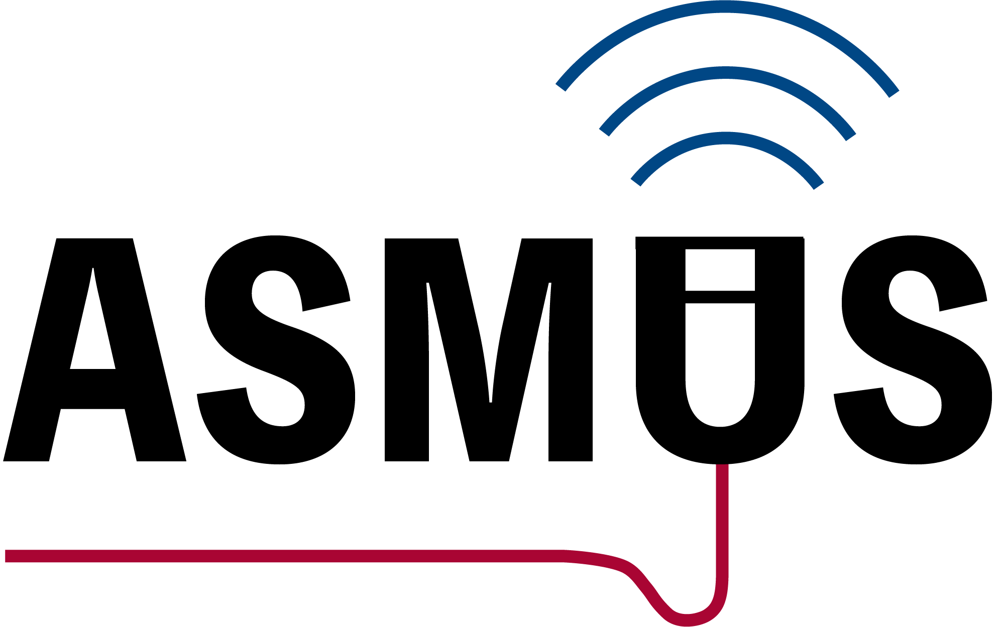
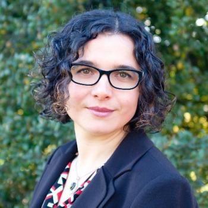
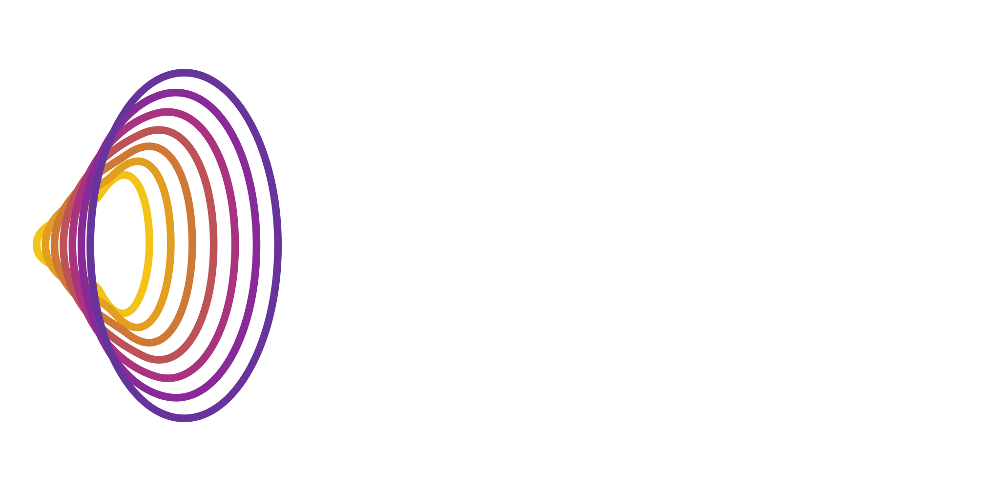

# ASMUS 2026

  

**The 7th International Workshop on Advances in Simplifying Medical UltraSound (ASMUS) will be held in conjunction with MICCAI 2026, as the official workshop of the Special Interest Group on Medical Ultrasound (SIG-MUS).**

## News

<!-- - **[April 2026]** Call for Papers! Deadline: **June 26, 2026, 23:59 PT**. -->
- **[May 2026]** The OpenReview submission portal is now open! <a href="https://openreview.net/group?id=MICCAI.org/2026/Workshop/ASMUS#tab-recent-activity" target="_blank">Submit here</a>. This is the correct submission portal for ASMUS 2026.
- **[May 2026]** Call for Reviewers! We welcome researchers and practitioners with expertise to join the ASMUS 2026 reviewer team. Interested reviewers can apply via the <a href="https://docs.google.com/forms/d/1g3GplrxM1987I7GTx36XO5avT6THBb6v7E90DIPdxbs" target="_blank">reviewer application form</a>.
- **[April 2026]** Call for Papers! Deadline: **June 26, 2026, 23:59 PT**.

## Overview

In 2026, ASMUS continues its community effort to unite researchers across the often-segregated Medical Image Computing (MIC) and Computer-Assisted Intervention (CAI) domains, with the goal of identifying key challenges and accelerating the next breakthroughs in ultrasound. The central vision of "simplifying ultrasound" is to make ultrasound more accessible, usable, and interpretable by non-specialists, while enhancing its clinical utility and supporting seamless integration into real-world healthcare workflows.

This year's ASMUS will maintain a strong focus on artificial intelligence (AI) and medical robotics for assisting ultrasound acquisition and interpretation, as well as ultrasound-guided interventions and surgery. A central theme remains the user-dependent nature of ultrasound, motivating research on operator-aware and human-in-the-loop methods that improve accessibility, reliability, and clinical integration.

In addition, ASMUS 2026 will expand its scope in two directions:

- **Frontier AI for ultrasound**, including foundation, generative, multimodal, physics-aware, and agentic AI methods.
- **Translational ultrasound AI for real-world clinical use**, promoting work that bridges methodological advances and deployment in routine care.

## Topics of Interest

### Ultrasound Assisted by Artificial Intelligence and Medical Robotics
- Ultrasound imaging with robotic (automated) assistance
- Machine learning methods in ultrasound analysis, diagnosis, and guidance
- Automated interpretation and measurement for ultrasound
- Ultrasound quality and skill assessment
- Human-in-the-loop clinical decision support
- Physics-informed AI methods for ultrasound
- Spatiotemporal and volumetric ultrasound modeling (e.g., 2D+t, 3D, 3D+t)
- Ultrasound foundation models (e.g., pretraining, adaptation)
- Multimodal and agentic AI for ultrasound (e.g., combining images with text, reports, and clinical context)
- Translational ultrasound AI

### Multimodality Ultrasound Imaging

- Ultrasound with other non-imaging sensory information (e.g., positional and eye tracking)
- Ultrasound with another pre-/intra-procedural imaging (e.g., camera videos, CT, MR, fluorescence)
- Different modes of ultrasound imaging (e.g., photoacoustic, Doppler, functional ultrasound, tissue quantification, contrast-enhanced ultrasound, blood speckle imaging, wearable ultrasound)

### Applications

- Global healthcare
- Training sonographers and other users
- Assisting non-expert healthcare professionals
- Point-of-care ultrasound systems and scenarios
- Assisting surgery and interventions
- Streamlining clinical ultrasound workflow
- Sonography data science

## Submission Guidelines

We welcome original research contributions and proof-of-concept studies from novel research directions.

- **Format:** Papers must be written in [Springer LNCS format](https://www.springer.com/gp/computer-science/lncs/conference-proceedings-guidelines), with a maximum of **8 pages** (text, figures, and tables) plus **up to 2 pages** for references only.
- **Submission:** Papers are submitted electronically via [OpenReview](https://openreview.net/group?id=MICCAI.org/2026/Workshop/ASMUS&referrer=%5BHomepage%5D(%2F)).
- **Reviewer Nomination:** Each paper must nominate **at least one unique reviewer**. Detailed reviewer information should be provided through OpenReview during submission.
- **Peer Review:** All submissions undergo double-blind peer review. Each paper is assessed by at least 3 reviewers, evaluated on scientific merit, relevance, novelty, methodology soundness, and clinical impact. The review panel combines experienced researchers with early-career reviewers, managed by the Program Chairs.
- **Publication:** Accepted papers will be published in **Springer LNCS** as part of the MICCAI Satellite Events joint proceedings. For past proceedings, please visit the [SIG-MUS page](https://miccai.org/index.php/special-interest-groups/sig-mus/).
- **Presentation:** Authors of accepted papers are required to present in person. All accepted papers are also offered the opportunity to present a live demonstration.
- **Awards:** Top submissions will be considered for industry-sponsored awards. More details to be updated.

> **Open Access & Patent Notice:** An open-access version of all accepted papers from the MICCAI 2026 Satellite Event ASMUS will be made available on the MICCAI Society website no earlier than one week before the first day of the conference. Authors intending to file patents are responsible for ensuring that all necessary filings are completed prior to this public release.

## Important Dates

| | |
| -------------------------------- | -------------------------- |
| June 26, 2026                    | Paper Submission Deadline  |
| July 10, 2026                    | Paper Review Deadline      |
| July 17, 2026                    | Notification of Acceptance |
| August 3, 2026                   | Camera Ready Submission    |
| October 1, 2026                  | ASMUS Workshop             |

## Keynote Speakers

  

    
  

  

    <h3 style="margin-top:0; margin-bottom:6px;">Mirabela Rusu</h3>
    

      <strong>Stanford University, USA</strong>
    

    

      <em>Keynote title: TBD</em>
    

    

      Dr. Rusu is an Assistant Professor, in the Department of Radiology, and, by courtesy, Department of Urology and Biomedical Data Science, at Stanford University, where she leads the Personalized Integrative Medicine Laboratory (PIMed).
    

  

  

    
  

  

    <h3 style="margin-top:0; margin-bottom:6px;">Oliver Zettinig</h3>
    

      <strong>ImFusion GmbH, Germany</strong>
    

    

      <em>Keynote title: TBD</em>
    

    

      Head of Ultrasound | Senior Research Scientist, ImFusion GmbH, Consulting, research and development in advanced medical image computing technologies.
    

  

## Sponsors and Partners

  

    

      <a href="https://imfusion.com/" target="_blank"
         style="font-size:1.5em; font-weight:700; text-decoration:underline; text-underline-offset:6px; color:#16324f;">
        ImFusion
      </a>
    

    

      
    

  

  

    

      <a href="https://miccai.org/index.php/special-interest-groups/sig-mus/" target="_blank"
         style="font-size:1.5em; font-weight:700; text-decoration:underline; text-underline-offset:6px; color:#16324f;">
        SIG-MUS
      </a>
    

    

      
    

  

  

    

      <a href="https://www.scanvio.com/" target="_blank"
         style="font-size:1.5em; font-weight:700; text-decoration:underline; text-underline-offset:6px; color:#16324f;">
        Scanvio Medical
      </a>
    

    

      
    

  

## Awards

  

    To recognize outstanding scientific contributions and encourage active participation,
    ASMUS 2026 will present several awards generously sponsored by
    <strong>SIG-MUS</strong>, <strong>ImFusion</strong> and <strong>Scanvio Medical</strong>.
  

  <h3>🏆 Best Paper Awards</h3>
  <ul>
    <li><strong>Best Paper:</strong> $250 (sponsored by <strong>Scanvio Medical</strong>)</li>
    <li><strong>Best Paper Runner-up (×2):</strong> $150 each</li>
  </ul>

  <h3>🎤 Best Presentation Awards</h3>
  <ul>
    <li><strong>Best Presentation:</strong> $250 (sponsored by <strong>SIG-MUS</strong>)</li>
    <li><strong>Best Presentation Runner-up (×2):</strong> $150 each</li>
  </ul>

  <h3>📌 Best Poster Awards</h3>
  <ul>
    <li><strong>Best Poster:</strong> $250 (sponsored by <strong>ImFusion</strong>)</li>
    <li><strong>Best Poster Runner-up (×2):</strong> $125 each</li>
  </ul>

  

    We encourage all authors to submit their latest research and participate in ASMUS 2026 for the opportunity to showcase their work, gain visibility within the ultrasound community, and compete for these awards.
  

## Organizers

### Chairs

- Qingjie Meng (Co-Chair, University of Birmingham, UK)
- Mohammad Farid Azampour (Co-Chair, Technical University of Munich, DE)

### Organising Committee

- Qingjie Meng (University of Birmingham, UK)
- Mohammad Farid Azampour (Technical University of Munich, DE)
- Nassir Navab (Technical University of Munich, DE)
- Yipeng Hu (University College London, UK)
- Alison Noble (University of Oxford, UK)
- Stephen Aylward (Kitware, USA)
- Purang Abolmaesumi (University of British Columbia, CA)
- Alberto Gomez (Ultromics, UK)
- Andrew King (King’s College London, UK)
- Bishesh Khanal (NAAMII, Nepal)
- Ana Namburete (University of Oxford, UK)
- Bernhard Kainz (FAU Erlangen-Nürnberg, DE, and Imperial College London, UK)
- Emad Boctor (Johns Hopkins University, USA)
- Thomas van den Heuvel (Radboud University, NL)
- Wolfgang Wein (ImFusion, DE)
- Parvin Mousavi (Queen’s University, CA)
- Veronika Zimmer (Technical University of Munich, DE)
- Tina Kapur (Brigham and Women’s Hospital and Harvard Medical School, USA)
- Ilker Hacihaliloglu (University of British Columbia, CA)

### Delivery Team

- Shiqi Huang (Program Chair, University College London, UK)
- Wen Yan (Program Chair, University College London, UK)
- Yingyu Yang (Communication Chair, University of Oxford, UK)
- Shuwei Xing (Web Chair, University of Oxford, UK)
- Lingyu Chen (Web Chair, University of Birmingham, UK)

### Advisory Panel

- Gabor Fichtinger (Queen’s University, CA)
- Kawal Rhode (King’s College London, UK)
- Russ Taylor (Johns Hopkins University, USA)
- Chris de Korte (Radboud University Nijmegen, NL)
- Reza Razavi (King’s College London, UK)
- Joseph Hajnal (King’s College London, UK)

<!-- ## Author Award

| Name of recipient           | Paper                                                                                   | Award                       |
|-----------------------------|-----------------------------------------------------------------------------------------|------------------------------|
| Oladokun, E.               | From Transthoracic to Transesophageal: Cross-Modality Generation using LoRA Diffusion  | Best paper award             |
| Noe Bertramo                 | DiffUS: Differentiable Ultrasound Rendering from Volumetric Imaging         | Best paper runner up         |
| Paul Wilson                | DualTrack: Sensorless 3D Ultrasound needs Local and Global Context               | Best paper runner up         |
| Mengting Yang          | Det-SAMReg: Few-Shot Medical Image Registration using Vision Foundation Models  | Best presentation award      |
| Diane Kim               | TREAT-Net: Tabular-Referenced Echocardiography Analysis for Acute Coronary Syndrome Treatment Prediction  | Best presentation runner up  |
| Md Kamrul Hasan                  | Motion-enhanced Cardiac Anatomy Segmentation via an Insertable Temporal Attention Module         | Best presentation runner up  |
| Cho Kim                 | Learning to Stop: Reinforcement Learning for Efficient Patient-Level Echocardiographic Classification        | Best poster award            |
| Gajendra Singh       | Guide2Heart: Proximity Guidance for Standard Echocardiographic View  | Best poster runner up |
| Injune Hwang         | D.A.R.K.: Dynamic Graphs based Angle-aware Registration of Knee Ultrasound Point Clouds                   | Best poster runner up|

## Reviewer Award
### Winners: 
-Yanfeng Zhou
-Haoran Dou
-Bernhard Kainz
-Yaoduo Zhang
-Mingyuan Luo

### Notable Reviewers:
Alexander Thorley, Zhifang Gao, Rongjun Ge, Yanlin Chen, Tao Zhou, Shumao Pang, Jun Cheng, Mingyuan Luo, Xinyan Fang, Qiming Huang, Hussain Alasmawi, Haoming Zhang -->
